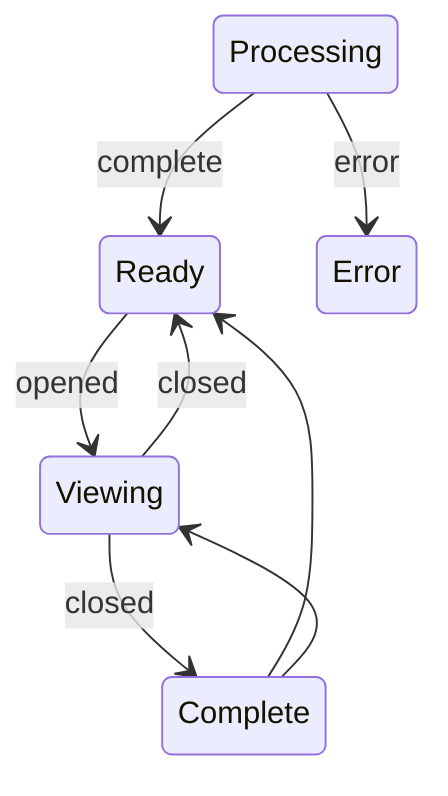

# Case browser

| Tool        | Description                          |
| ----------- | ------------------------------------ |
|        | Open case |
|    | Set case status |
|  | Reprocess case |
|    | Delete case |

| Tool        | Description                          |
| ----------- | ------------------------------------ |
|        | Show info pane |
|          | Update case tags |
|    | Refresh |
|        | Clear sort |

## Managing cases
Cases can have several statuses. 

| Status | Description |
| ------ | ----------- |
| Processing | Case is still processing |
| Ready | Ready for viewing |
| Viewing | Currently being viewed |
| Complete | Marked complete |
| Delete | Marked for deletion |
| Error | Error while processing |

Processes first appear as "Processing." While processing, they can't be viewed other than by staff. If the processing fails, they are marked as "Error," and again are only viewable by staff accounts.

If a case is read-only or not in the "Viewing" state, this is displayed in the Viewer as one or more tags in the top bar:

## Opening, closing, and locking cases

Opening a "Ready" case updates the case to "Viewing." It also sets you as the case's current viewer. While you are viewing a case, other users can view but not edit it. The case will stay open until the user manually closes the case via the <button>:fontawesome-regular-rectangle-xmark: Close</button> button on the top bar. This will open a prompt to either reset the case back to Ready, or move it to Completed. Completed cases are read-only.

## Reopening completed cases

Users can reopen their own completed cases using the <button>:fontawesome-solid-lock-open: unlock</button> button on the Case Browser. Staff may reopen any case, even cases that they are not the current viewer for. 

